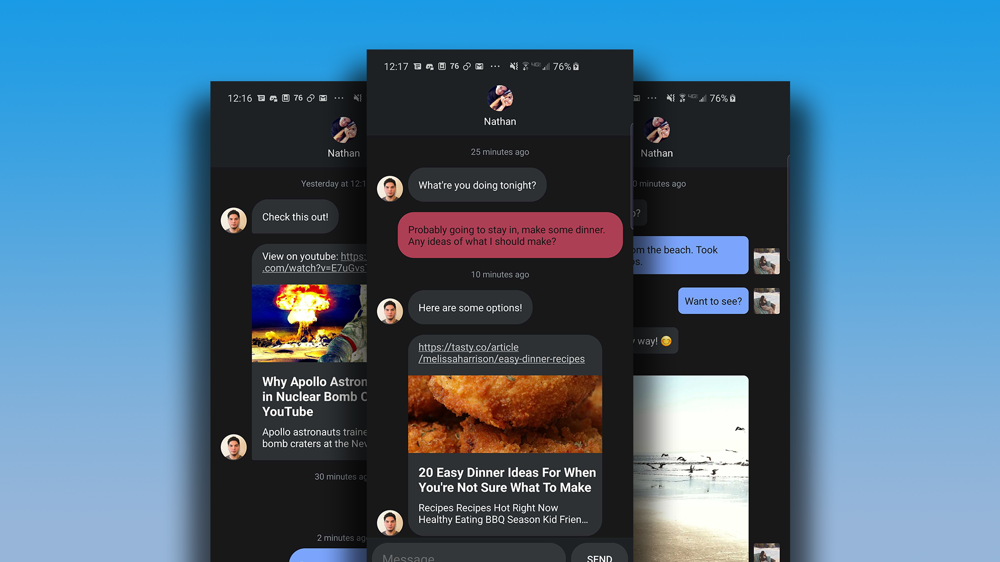

# Chat Thread for Android

Chat Thread gives you the base you need to start developing your own Chat application.

> Please note: This library is still in an early development stage. Until I am comfortable with how it performs, it will not be listed on any android package managers.

## What's included?

* The Message Thread component.
* Built in support for three core Message types.
    - Text Messages, Image messages, Preview Messages
* The ability to parse a message string into it's respective Message Type.
    - "https://google.com" -> Preview Message
    - "https://mysite.com/some_image.png" -> Image Message
* The ability to implement custom Message Types using your own Views.
* Adapter or List based Message Thread implementations.
* Avatars and images support both Bitmaps and Drawables, load them how you want!
* Much, much more!

## How can I get started?

Check out the [demo project](./demo) and the [documentation](./docs) for information on how to get started!